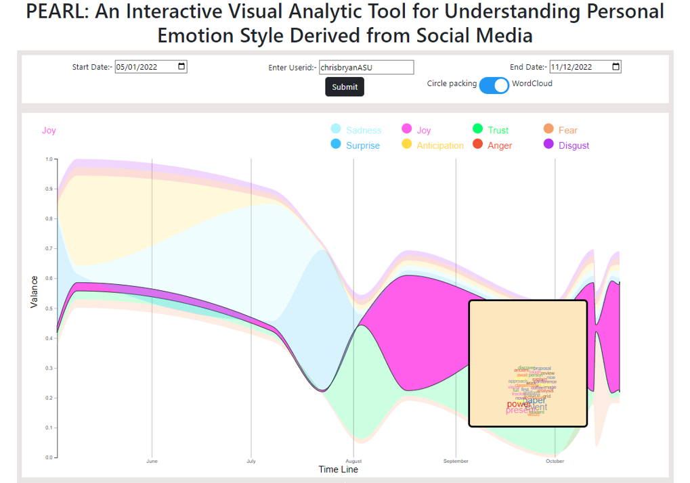
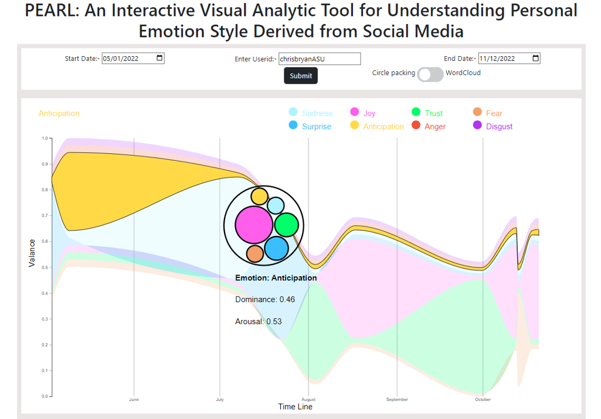
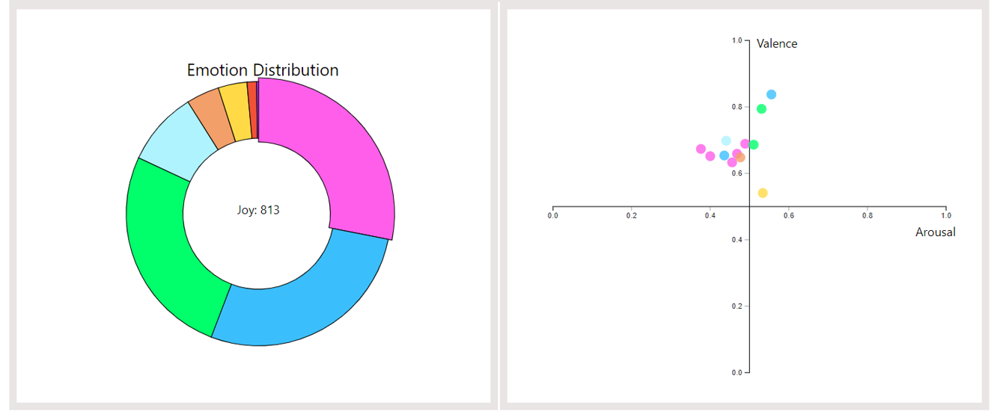

# Visualizing Emotion Data : PEARL

Pearl is an Interactive Visual Analytic Tool for Understanding Personal Emotion Style Derived from Social Media

This code provides a web-based visualization tool for analyzing emotion data, with a focus on valence and arousal. The code utilizes D3.js for creating interactive visualizations. The main features of this code include:

## Features

1. **Stream Graph Visualization**: This code generates a stream graph to visualize emotional data over time. It represents the eight primary emotions (Sadness, Joy, Trust, Fear, Surprise, Anticipation, Anger, Disgust) and their changes over time. You can change the date range to view data for specific time periods.

2. **Word Cloud**: The word cloud provides insights into the most frequently occurring words associated with a selected emotion during a specific time range.

3. **Pie Chart**: The pie chart displays the distribution of emotions for a selected time period. You can hover over sections of the pie chart to see emotion-specific data.

4. **Scatter Plot**: The scatter plot displays the relationship between valence and arousal. You can explore the emotional valence and arousal values for your data points.

5. **User Customization**: You can input your user ID to load your own data. The visualization adapts to your data, so you can analyze and explore your specific emotional patterns.

## Prerequisites

- Ensure you have a web server to host the HTML and JavaScript files, as some features may require a server for proper functionality. You can use a simple local server like `http-server` or upload the files to a web hosting service.

- Make sure you have the necessary data files (e.g., CSV files) in the 'data' directory. These files should contain your emotional data for visualization.

## Usage

1. **Load Data**: Input your user ID, and click the "Submit" button to load your data. The code will read your CSV files and generate visualizations based on your emotional data.

2. **Stream Graph and Date Selection**: The stream graph shows how emotional states change over time. Use the date selection range to focus on specific time periods.

3. **Pie Chart**: The pie chart displays the distribution of emotions for the selected time range. Hover over sections to see emotion-specific data.

4. **Word Cloud**: Click on an emotion in the pie chart to view a word cloud for that emotion during the chosen time period.

5. **Scatter Plot**: The scatter plot visualizes the relationship between valence and arousal. Explore how your data points are distributed in the valence-arousal space.

6. **Customization**: The code allows you to customize your data visualizations based on your user ID and data files.

## Installation

1. Clone the repository or download the code files to your local machine.

2. Make sure you have the necessary data files in the 'data' directory.

3. Host the HTML and JavaScript files on a web server. You can use a local server for testing or upload the files to a web hosting service for public access.

4. Open the index.html file in a web browser and start using the visualization tool.

## Dependencies

- This code uses D3.js for creating data visualizations. Ensure that the D3.js library is available and correctly linked in the HTML file.

## License

This code is available under the [MIT License](LICENSE).

## Author

This code was developed following Developers.

- [Vraj Rana](https://github.com/vrcoder70)
- [Tirth Patel](https://github.com/tirthasheshpatel)
- [Yash Shah](https://github.com/YashDilipShah)
- [Shubham Sudhakar](https://github.com/shubhamX1438)
- [Mukesh Shah](https://github.com/jhamukesh998)
- [Tirth Patel](https://github.com/Tirth1306)

Feel free to modify and enhance this code to suit your specific needs or contribute to its development.
